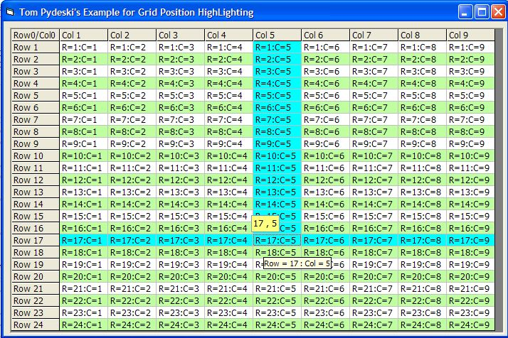



## Grid Highlight

### Description

This code is in response to a question from armbararan, who wanted to highlight the navigation of the flex grid. I threw this together from some of my other projects as a quick example to allow highlighting of gridrow and gridcol in the msflexgrid.
 
### More Info
 
Move Mouse over Grid.

Uses MS FlexGrid Control.

The Row and Column will highlight

             |
---                |---
**Submitted On**   |2004-10-29 18:52:32
**By**             |[Tom Pydeski](https://github.com/Planet-Source-Code/PSCIndex/blob/master/ByAuthor/tom-pydeski.md)
**Level**          |Beginner
**User Rating**    |5.0 (15 globes from 3 users)
**Compatibility**  |VB 6\.0
**Category**       |[Miscellaneous](https://github.com/Planet-Source-Code/PSCIndex/blob/master/ByCategory/miscellaneous__1-1.md)
**World**          |[Visual Basic](https://github.com/Planet-Source-Code/PSCIndex/blob/master/ByWorld/visual-basic.md)
**Archive File**   |[Grid\_Highl18118710292004\.zip](https://github.com/Planet-Source-Code/tom-pydeski-grid-highlight__1-56990/archive/master.zip)

